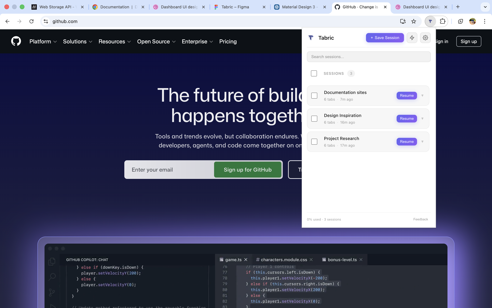
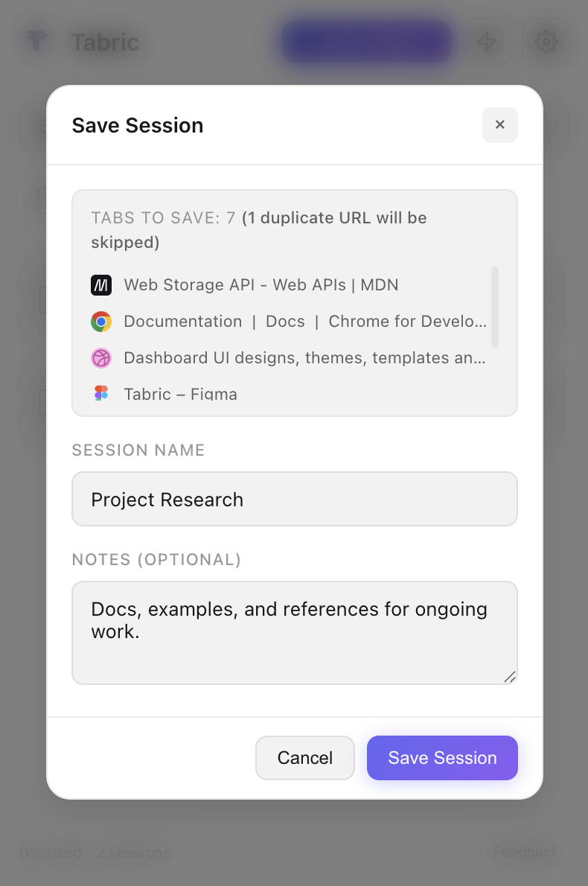
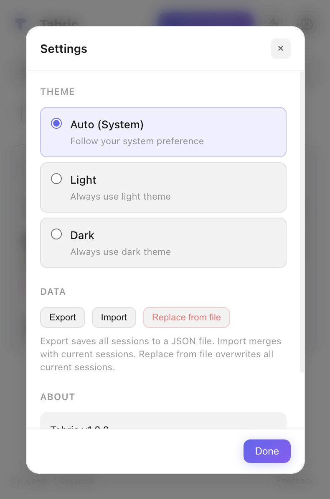
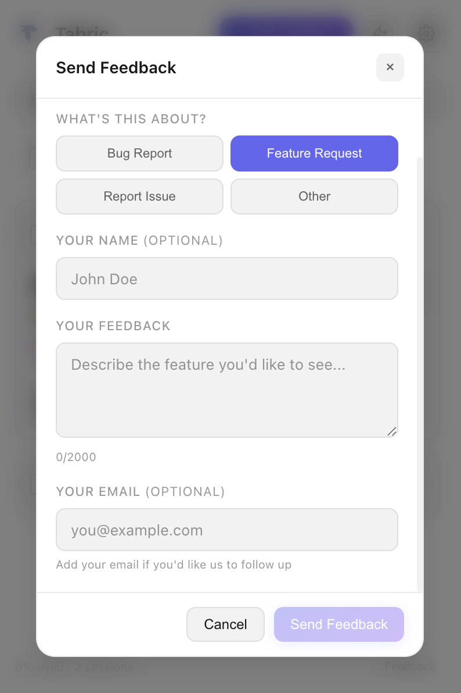

# Tabric

Tabric is a Chrome extension that helps you save and restore browser tab sessions with notes. Organize your browsing workflow, switch between projects easily, and never lose important tabs again.

**Install on Chrome Web Store:** [Tabric](https://chromewebstore.google.com/detail/kdfeeoijbcoogiponlffiaocdadgkpio?utm_source=item-share-cb) 

---

## Features

- Save and organize browser tab sessions
- One-click Quick Save
- Restore sessions anytime
- Edit or delete sessions easily
- Search and filter sessions by name or notes
- Select multiple sessions for bulk delete
- Session notes displayed when restoring
- Copy sessions as formatted text
- Light and dark theme support
- All data stored locally on your device

> Closed the extension while typing? Don’t worry, your text is automatically restored when you open it again (drafts clear after 24 hours).

---

## Backup & Restore

- **Export** — Save all sessions to a JSON file for backup or transfer.
- **Import** — Merge sessions from a JSON file with your current sessions.
- **Replace from file** — Overwrite all current sessions with the sessions from the chosen JSON file. Use with care; current sessions are replaced.

Available in **Settings** (⚙️) under the **DATA** section.

---

## Screenshots

  

  
  
 

   
  

---

## Privacy

For more details, see the [Privacy Policy](PRIVACY.md).

Tabric stores sessions, notes, and drafts only on your device. No browsing data, tabs, or notes are uploaded to any server. If you use the in-app feedback form, only the information you enter is sent to the developer via EmailJS.

---

## Technologies

- JavaScript (ES6+)
- Chrome Extension (Manifest V3)
- Chrome APIs (tabs, storage)
- React (UI components)
- HTML5 & CSS3
- EmailJS (feedback integration)

---

## Support

For help, bug reports, or suggestions:

**Email:** atulyasr3@gmail.com

**In-app:** Tabric → Feedback (bottom-right)

---

*— Atulya*

